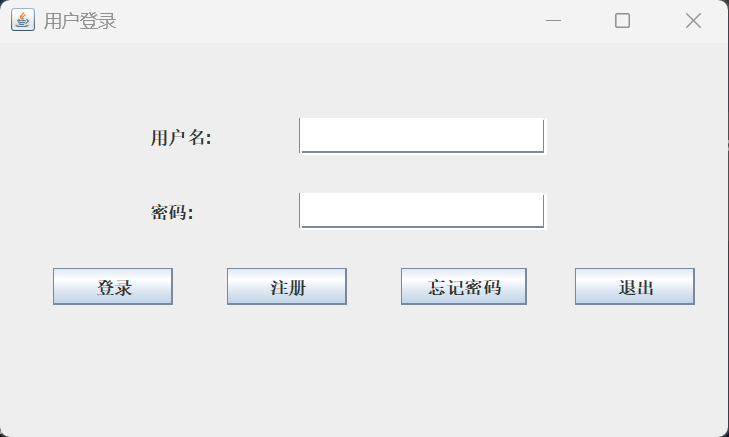
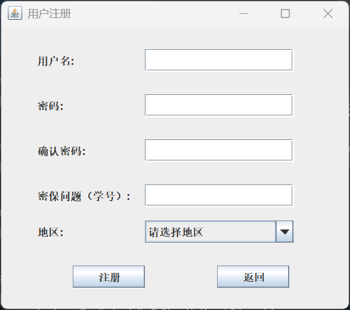
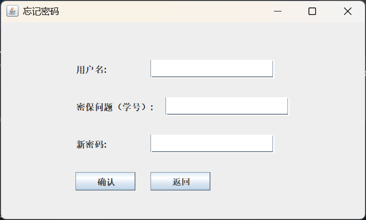
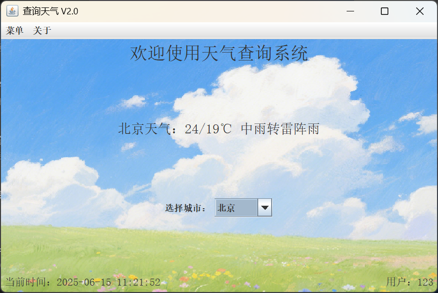
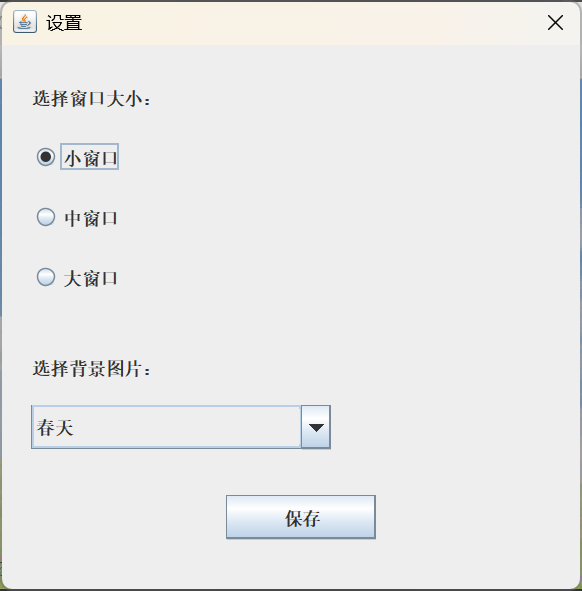

# 项目名称
天气查询系统

## 项目简介
天气查询系统是一款基于 Java Swing 的桌面应用程序，旨在为用户提供便捷的天气查询服务。用户可以通过登录系统查看当前城市的天气信息，并支持切换城市、修改背景图片等功能。系统采用模块化设计，易于扩展和维护。

## 项目采用技术

|技术/工具|描述与应用|
|-|-|
|Java Swing|用于实现桌面应用程序的图形用户界面 (GUI)，提供美观且易用的用户交互界面。|
|MySQL|用于存储用户信息、城市编码和天气数据，保证数据的持久化和高效查询。|
|Maven|用于实现自动化打包。|
|Jsoup (HtmlParser)  |用于从天气网站抓取实时天气信息，实现天气数据的自动更新（爬虫）。|
|数据库连接池|提高数据库访问效率。|
| MVC 模式|采用 MVC 架构，提升代码的分层管理和可维护性，降低模块耦合度。|
|配置文件| 通过外部配置文件管理数据库连接、界面设置等参数，便于灵活调整和部署。|
|Git| 用于版本控制和团队协作，确保代码管理规范，支持多人协作开发。|
|Issue 管理|通过 GitHub Issue 推进项目进度，分配任务，跟踪问题与优化建议。|
|容错处理|在用户输入和系统操作中加入完善的容错机制，提高系统健壮性和用户体验。|

## 功能需求分析
1. 用户管理
    - 用户注册：支持用户注册，填写用户名、密码、密保问题和地区。
    - 用户登录：验证用户名和密码，登录系统。
    - 密码重置：通过密保问题验证后重置密码。
    - 用户信息容错校验：对用户输入进行有效性和安全性检查，防止异常输入。
2. 天气查询
    - 自动显示用户所在地区的天气信息。
    - 支持切换城市，动态更新天气信息。
    - 天气查询失败自动重试与错误提示，保障用户体验。
3. 界面设置
    - 支持修改窗口大小（小、中、大）。
    - 支持更改背景图片（春、夏、秋、冬）。
    - 界面美观，风格统一，提升整体视觉体验。
    - 配置文件驱动界面设置，便于个性化调整。
4. 数据管理
    - 城市编码和天气信息存储在 MySQL 数据库中。
    - 支持从数据库动态加载城市列表和天气信息。
    - 使用数据库连接池提升数据访问效率。
5. 其他功能与特点
    - 采用 MVC 架构模式，分为数据层（DatabaseUtils和UserUtils等），视图层（ui包），控制层（散在各个JFrame类），模块职责清晰。
    - 项目采用 Git 进行代码管理，团队协作流畅。
    - 使用 Issue 持续推进项目，跟踪开发进度与问题反馈。
    - 完善的容错处理，系统稳定性强。

## 项目亮点
1. **模块化设计与高可维护性**  
   - 用户管理、天气查询、界面设置等功能模块独立，采用 MVC 与 DAO 分层架构，便于维护和扩展。
2. **动态天气更新与爬虫集成**  
   - 使用 Jsoup 实现天气数据爬取，自动抓取并更新数据库中的实时天气信息，提升数据时效性。
3. **个性化与美观界面体验**  
   - 用户可灵活调整窗口大小与背景图片，界面美观，配置文件支持自定义设置，满足多样化需求。
4. **高效数据管理**  
   - MySQL 数据库存储，配合数据库连接池优化性能，支持大规模数据读写与高并发访问。
5. **团队高效协作与敏捷开发**  
   - 项目全程使用 Git 进行版本控制，利用 Issue 进行任务分配和进度追踪，团队分工明确，开发效率高。
6. **完善的容错机制**  
   - 用户各类输入均有严格校验并给出友好提示，系统关键节点均有异常处理，保障稳定运行。

## 主要功能截图

### 主要功能截图
1. 登录界面  
  

    
  

2. 注册界面
  

    
  

3. 修改密码界面
  

    
  

4. 主页面  
  

    
  

5. 其它功能  
  

    
  

## 团队成员负责模块

|姓名|GitHub用户名|负责模块|主要工作|
|-|-|-|-|
|刘乐飞|LiXinGDBW|数据库，工具类与天气查询模块|构建AppJFrame,DatabaseUtils,WeatherInfoManager和WeatherUtils，数据库更新与修改；使用 Jsoup 抓取天气数据并存储到数据库中；完成天气查询功能的实现。|
|魏祥涵|suisuiyuanpingan|用户管理模块|构建LoginJFrame,RegisterJFrame和UserUtils，实现用户注册和登录功能。|
|张博文|ZBW-king|界面设置与背景管理模块|构建App,BackgroundUtils和RechangePasswordJFrame，实现窗口大小调整和背景图片更改功能；实现用户更改密码功能。|

## 项目Git地址
[https://github.com/LiXinGDBW/WeatherApp](https://github.com/LiXinGDBW/WeatherApp)

## 成员github地址
- 刘乐飞：[https://github.com/LiXinGDBW](https://github.com/LiXinGDBW)
- 魏祥涵：[https://github.com/suisuiyuanpingan](https://github.com/suisuiyuanpingan)
- 张博文：[https://github.com/ZBW-king](https://github.com/ZBW-king)

---
